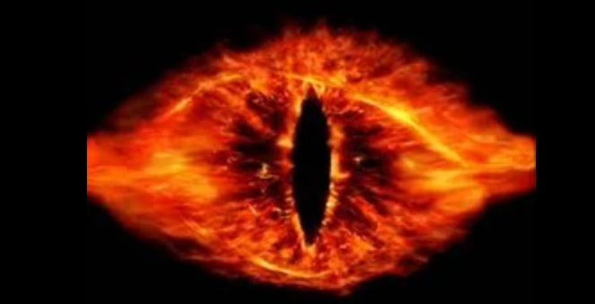

## The lord of rings

If you have watched the ***The Lord of the Rings***, you must know what I have done. Yes, it's **The Eye of Sauron**! 

In this project, I intend to show browsers can do more than you can imagine. This project is a very casual and interesting attempt on shaders running in browsers.

- Some technologies used are React.js, React-Three-Fiber.js, Three.js and GLSL.
- Some 3D models can be found: https://sketchfab.com
- Some shaders can be found: https://www.shadertoy.com